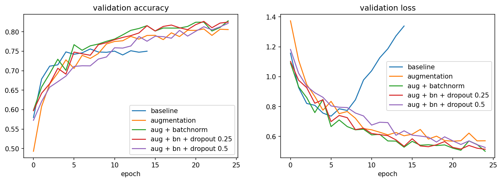
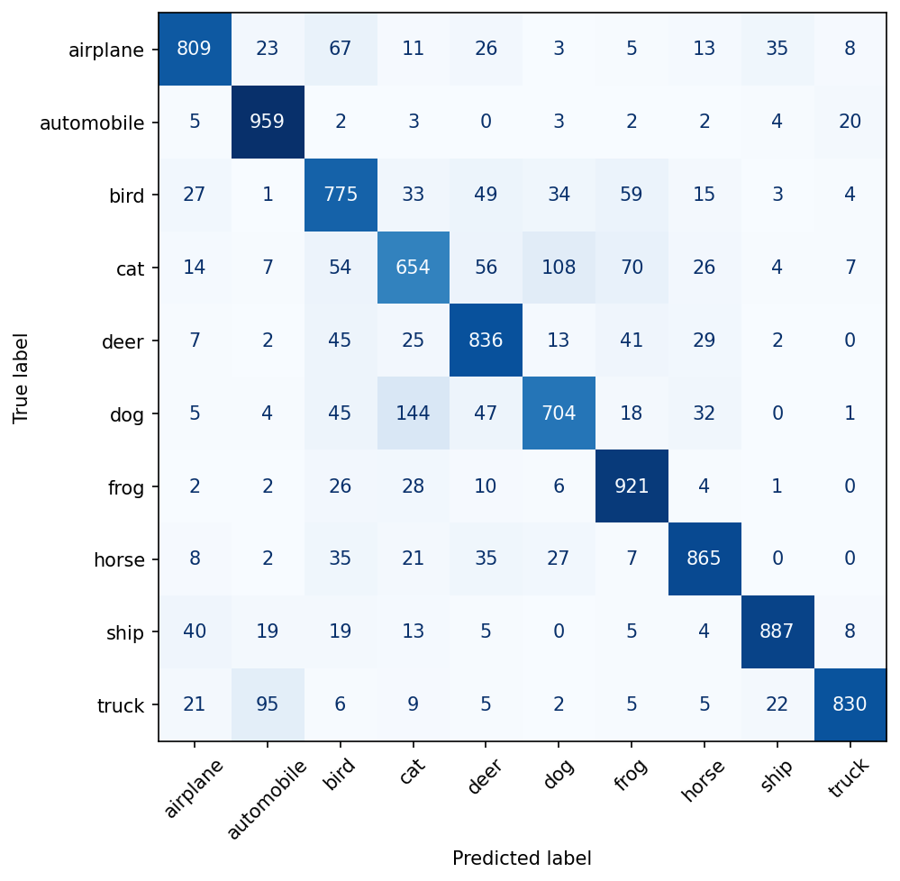

# CIFAR-10 CNN: measuring what each regularisation technique contributes

A convolutional neural network for CIFAR-10 image classification, built in PyTorch, with a controlled comparison of data augmentation, batch normalisation and dropout against a plain baseline.

**Result: 82.4% test accuracy** with a 3-block CNN of about 620,000 parameters, trained for 25 epochs on a free Colab T4 GPU.

This is the second of three portfolio projects. The first, [numpy-mlp-mnist](https://github.com/warrior-here/numpy-mlp-mnist), implements an MLP and backpropagation by hand in NumPy. This one moves to PyTorch and convolutions.

## Summary of findings

| Run | Epochs | Best val acc | Final train acc | Final val acc | Train/val gap |
|---|---|---|---|---|---|
| Baseline | 15 | 75.6% | 97.4% | 75.0% | 22.4 pts |
| + Augmentation | 25 | 80.7% | 83.7% | 80.6% | 3.1 pts |
| + Batch norm | 25 | **82.8%** | 84.6% | 82.8% | 1.8 pts |
| + Dropout 0.25 | 25 | 82.7% | 82.0% | 82.5% | -0.5 pts |
| + Dropout 0.5 | 25 | 82.2% | 79.1% | 82.2% | -3.0 pts |

Each run adds one technique to the run above it.

- **The baseline overfits badly.** Validation loss reaches its minimum at epoch 6 and then rises, while training accuracy climbs to 97%.
- **Data augmentation gives the largest gain**: +5.1 points of validation accuracy, and the train/validation gap falls from 22.4 to 3.1 points.
- **Batch normalisation adds +2.1 points** and speeds up early training (about 60% validation accuracy after one epoch, against about 49% without it).
- **Dropout does not help here.** Both rates finish within 0.6 points of batch norm alone, which is about the size of the sampling noise. With the gap already under 2 points there is little overfitting left to remove, and at p = 0.5 training accuracy (79.1%) falls below validation accuracy (82.2%), a sign of under-fitting within 25 epochs.

The selected model is augmentation + batch norm, chosen on validation accuracy. It was then evaluated once on the test set.



## Test set results

Test accuracy: **82.4%** (8,240 of 10,000 images), against 82.8% on validation.



| Class | Accuracy | Class | Accuracy |
|---|---|---|---|
| automobile | 95.9% | deer | 83.6% |
| frog | 92.1% | truck | 83.0% |
| ship | 88.7% | airplane | 80.9% |
| horse | 86.5% | bird | 77.5% |
| | | dog | 70.4% |
| | | cat | 65.4% |

- Cat and dog are the most confused pair: 144 dogs predicted as cats and 108 cats predicted as dogs.
- 95 trucks are predicted as automobiles, but only 20 automobiles as trucks.
- Most errors stay within a group: animals are confused with animals, and vehicles with vehicles.

## Method

**Data.** CIFAR-10: 60,000 colour images, 32x32 pixels, 10 classes. The 50,000 training images are split 45,000 / 5,000 into training and validation with a fixed seed. The 10,000 test images are held out until the end. Inputs are normalised per channel using statistics from the 45,000 training images only.

**Model.** Three convolution blocks (32, 64, 128 filters). Each block is a 3x3 convolution, optional batch norm, ReLU and 2x2 max-pooling. The classifier head is 2,048 -> 256 -> 10 with optional dropout after the hidden layer. The model has 620,586 parameters with batch norm enabled.

**Training.** Adam optimiser, learning rate 0.001, batch size 128, cross-entropy loss. Augmentation is a random crop (padding 4) and a random horizontal flip, applied to training images only.

**Protocol.** All choices (which techniques to keep, dropout rate, final model) were made on the validation set. The test set was evaluated once.

## Limitations

- **One seed per configuration.** With 5,000 validation images, sampling noise is about +/-0.5 points. The gains from augmentation and batch norm are well outside that; the differences between batch norm alone and the two dropout runs are not.
- **Run-to-run variation.** An earlier run of this notebook with the same seed gave validation accuracies that differed by up to 0.7 points per configuration, because GPU training is not fully deterministic. The ordering of baseline, augmentation and batch norm was the same in both runs.
- **Unequal epochs.** The baseline ran for 15 epochs and the other runs for 25. The baseline had peaked by epoch 8, and runs are compared on best validation accuracy.
- **No per-run tuning.** Learning rate and batch size were fixed at common defaults. Dropout was tried at two rates in one position, so the conclusion is limited to this setting.
- **Still improving at epoch 25.** The regularised runs had not plateaued, so longer training would likely raise accuracy.

## Possible next steps

- Repeat each configuration over several seeds and report mean and standard deviation.
- Train longer with a learning-rate schedule.
- Add residual connections and more depth.
- Add weight decay and label smoothing.

## Repository contents

| File | Purpose |
|---|---|
| `cifar10_cnn.ipynb` | Full notebook: data, model, training loop, all five runs, evaluation |
| `results.json` | Per-epoch loss and accuracy for every run |
| `cnn_cifar10.pt` | Trained weights of the selected model |
| `assets/` | Comparison plot and confusion matrix |
| `requirements.txt` | Python dependencies |

## How to run

1. Open `cifar10_cnn.ipynb` in Google Colab.
2. Select Runtime -> Change runtime type -> T4 GPU.
3. Run all cells. The five training runs take about 45 minutes in total.

To load the trained weights, define the `ConvBlock` and `CNN` classes from the notebook, then:

```python
model = CNN(use_bn=True)
model.load_state_dict(torch.load("cnn_cifar10.pt", map_location="cpu"))
model.eval()
```
